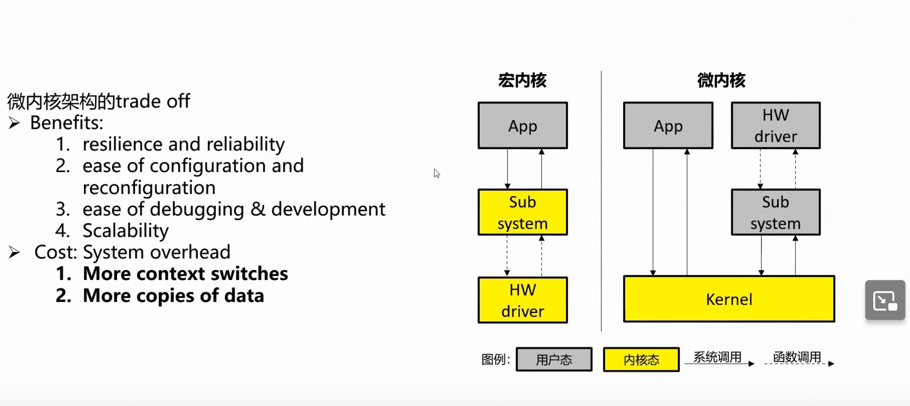
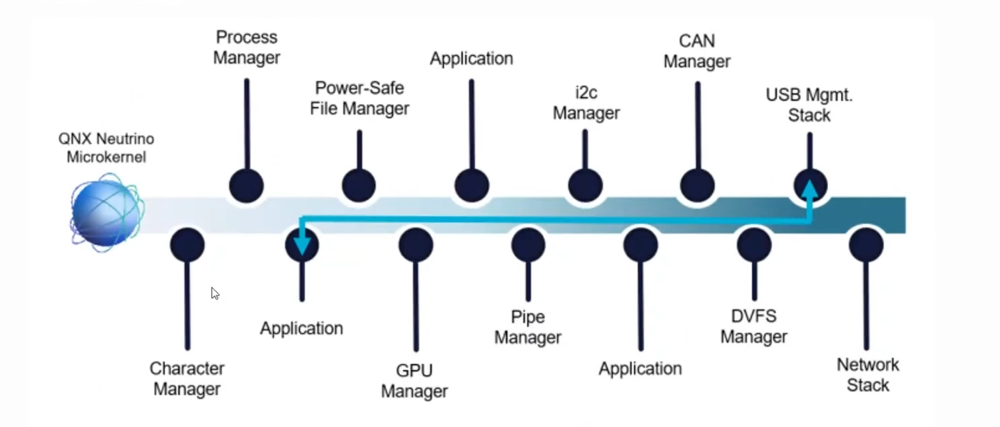
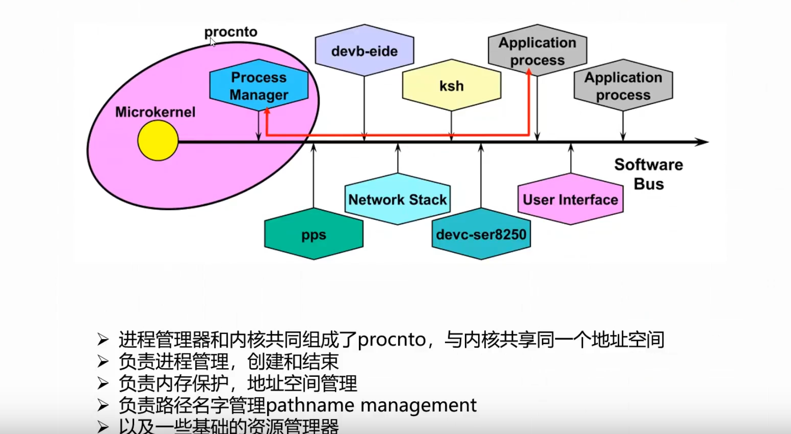
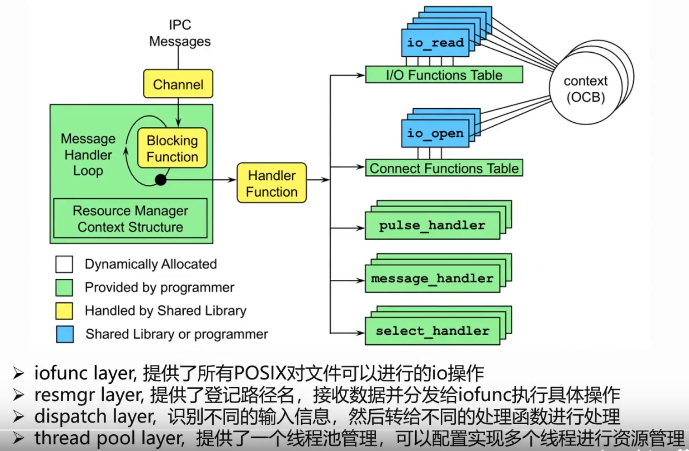
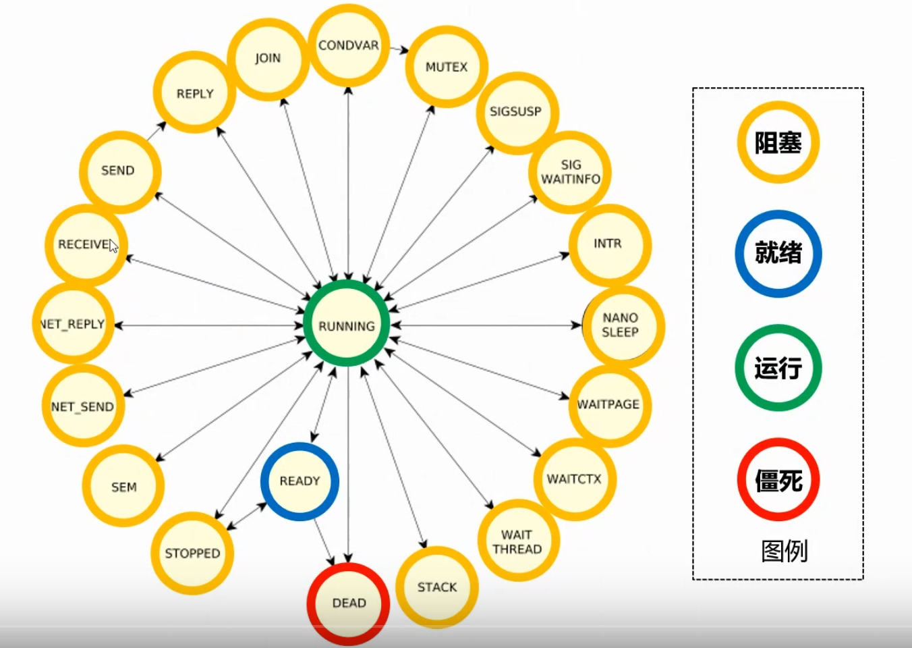
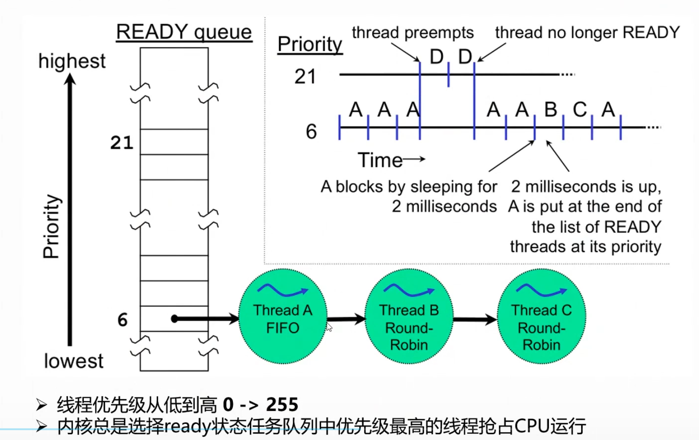
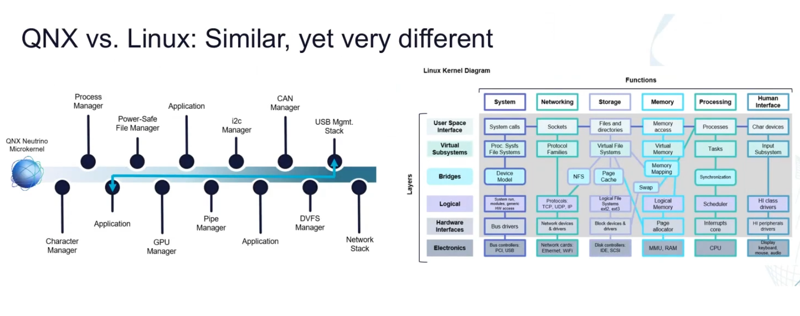

## 2023.5.5
### Ubuntu 22.04 中文输入法
- Setting->Regin&Language->Manage Installed Languages->Install/Remove Languages... 勾选简体中文，下载
- sudo apt install ibus-pinyin 下载ibus拼音
- Keyboard->Input Sources 点击+，双击Chinese，选择Chinese(Intelliget Pinyin)
- Restart
- 切换中英文可以使用Win+whitespace

### Ubuntu 22.04 安装deb包
- sudo dpkg -i code_1.78.0-1683145611_amd64.deb
- code #启动vscode

### ubuntu界面美化
- 安装oh-my-sh
    ```bash
    sudo apt install git # 安装git
    sudo apt install zsh # 安装zsh
    sh -c "$(wget https://raw.github.com/ohmyzsh/ohmyzsh/master/tools/install.sh -O -)" # 安装ohmysh
    git clone https://github.com/zsh-users/zsh-syntax-highlighting.git ${ZSH_CUSTOM:-~/.oh-my-zsh/custom}/plugins/zsh-syntax-highlighting # 安装语法高亮插件
    git clone https://github.com/zsh-users/zsh-autosuggestions ${ZSH_CUSTOM:-~/.oh-my-zsh/custom}/plugins/zsh-autosuggestions # 安装自动补全插件
    plugins=(git z extract zsh-syntax-highlighting zsh-autosuggestions) # 添加插件到～/.zshrc
    source ~/.zshrc # zshrc生效
    ```
- 配置p10k主题
    ```bash
    git clone --depth=1 https://github.com/romkatv/powerlevel10k.git ${ZSH_CUSTOM:-$HOME/.oh-my-zsh/custom}/themes/powerlevel10k
    ZSH_THEME="powerlevel10k/powerlevel10k" # 修改～/.zshrc
    ```
- 在vscode中设置terminal为zsh
  - 在设置里面搜索terminal.integrated，设置"terminal.integrated.defaultProfile.linux": "zsh"
- 一键配置脚本
```bash
#!/bin/bash

# 清理
sudo apt remove zsh -y
rm -rf ~/.zshrc ~/.zsh* ~/.oh-my-zsh*

# 安装Zsh和必要的依赖
sudo apt update -y
sudo apt install zsh git curl -y

# 安装Oh My Zsh
yes | sh -c "$(curl -fsSL https://raw.githubusercontent.com/ohmyzsh/ohmyzsh/master/tools/install.sh)"
# 安装Powerlevel10k主题以及必要插件
git clone --depth=1 https://github.com/romkatv/powerlevel10k.git ~/.oh-my-zsh/themes/powerlevel10k
git clone https://github.com/zsh-users/zsh-syntax-highlighting.git ${ZSH_CUSTOM:-~/.oh-my-zsh/custom}/plugins/zsh-syntax-highlighting # 安装语法高亮插件
git clone https://github.com/zsh-users/zsh-autosuggestions ${ZSH_CUSTOM:-~/.oh-my-zsh/custom}/plugins/zsh-autosuggestions # 安装自动补全插件

# 更改zshrc配置
search_pattern='ZSH_THEME="robbyrussell"'
replace_string='ZSH_THEME="powerlevel10k/powerlevel10k"'
replace_string=$(echo $replace_string | sed -e 's/\//\\\//g')
sed -i "s/${search_pattern}/${replace_string}/g" ~/.zshrc

search_pattern='plugins=(git)'
replace_string='plugins=(git zsh-syntax-highlighting zsh-autosuggestions)'
sed -i "s/${search_pattern}/${replace_string}/g" ~/.zshrc

# 启动p10k配置
zsh
```
### /etc/host作用
- /etc/hosts 文件是一个计算机系统中的一个本地主机名解析文件。它通常被用于在计算机上手动指定 IP 地址和主机名的映射关系。当在计算机上访问一个网站时，计算机通常需要将主机名（如 www.example.com）转换为一个 IP 地址，以便能够与该网站建立连接。这通常通过DNS进行，但是在某些情况下，可能需要手动指定这些映射关系，以避免需要使用 DNS 进行解析，或者为了将某个主机名指向一个特定的 IP 地址。

- 在Linux和其他类Unix操作系统上，/etc/hosts 文件被用于这个目的。例如，可以在该文件中添加一行 127.0.0.1 localhost，以指定 localhost 主机名解析到本地回环地址 127.0.0.1。这样，在浏览器中输入 http://localhost 时，计算机会自动将其解析为 127.0.0.1，从而连接到本地主机。


## 2023.5.6
### set指令
- set -x
  - 默认情况下，脚本执行后，屏幕只显示运行结果，没有其他内容。如果多个命令连续执行，它们的运行结果就会连续输出。有时会分不清，某一段内容是什么命令产生的。
- set -e
  - 如果脚本里面有运行失败的命令（返回值非0），Bash 默认会继续执行后面的命令。
  - set -e使得脚本只要发生错误，就终止执行。
- set -u
  - 执行脚本的时候，如果遇到不存在的变量，Bash 默认忽略它。
  - set -u就用来改变这种行为。脚本在头部加上它，遇到不存在的变量就会报错，并停止执行。


### bash -c
- -c
```
/bin/sh -c "./test.sh 1 2" # 使用sh启动一个由字符串表示的命令
CMD ["/bin/sh", "-c", "/start.sh ${SELECTIVE_FLAVOR}"] # dockerfile中使用CMD指令运行带参数的shell脚本
```

### 中间件
- 定义：中间件（英语：Middleware），又译中间件、中介层，是一类提供系统软件和应用软件之间连接、便于软件各部件之间的沟通的软件，应用软件可以借助中间件在不同的技术架构之间共享信息与资源。中间件位于客户机服务器的操作系统之上，管理着计算资源和网络通信。 -- 维基百科
- 性质：中间件是软件
- 作用层级：系统软件和应用软件之间、软件各部件之间；管理客户机与系统软件之间的计算资源和网络通信。
- 服务对象：中间件为应用软件服务，应用软件为最终用户服务，最终用户并不直接使用中间件
- 一些中间件
  - 消息中间件：支持在分布式系统之间发送和接收消息的软件。 如 Apache kafka, Apache RabbitMQ, NSQ, 阿里孵化开源的 Apache RocketMQ
  - 缓存服务中间件: 分布式的高速数据存储层，一般是内存存储。如 阿里 Tair，业界的 Redis
  - 任务调度：分布式环境下提供定时、任务编排、分布式跑批等功能的系统。如 阿里 SchedulerX
  - ...

### 消息队列
- MQ(Message Queue)
- 把数据放到消息队列叫做生产者，从消息队列里边取数据叫做消费者。生产者将数据放到消息队列中，消息队列有数据了，主动叫消费者去拿(俗称push)。消费者不断去轮询消息队列，看看有没有新的数据，如果有就消费(俗称pull)

### ZooKeeper
- ZooKeeper主要服务于分布式系统，可以用ZooKeeper来做：统一配置管理、统一命名服务、分布式锁、集群管理。
- 使用分布式系统就无法避免对节点管理的问题(需要实时感知节点的状态、对节点进行统一管理等等)，而由于这些问题处理起来可能相对麻烦和提高了系统的复杂性，ZooKeeper作为一个能够通用解决这些问题的中间件就应运而生了。
- ZooKeeper 是C/S结构(分成客户端和服务端),数据结构，跟Unix文件系统非常类似，可以看做是一颗树，每个节点叫做ZNode。每一个节点可以通过路径来标识.
- [参阅](https://mp.weixin.qq.com/s?__biz=MzI4Njg5MDA5NA==&mid=2247485115&idx=1&sn=5d269f40f820c82b460993669ca6242e&chksm=ebd747badca0ceac9953f82e08b1d1a49498ebd4af77ec5d628a0682bb9f0ac5ab347411f654&token=1741918942&lang=zh_CN#rd)

### Kafka
- 使用消息队列不可能是单机的（必然是分布式or集群）
  - Kafka天然是分布式的，往一个topic丢数据，实际上就是往多个broker的partition存储数据
- 数据写到消息队列，可能会存在数据丢失问题，数据在消息队列需要持久化(磁盘？数据库？Redis？分布式文件系统？)
  - Kafka会将partition以消息日志的方式(落磁盘)存储起来，通过 顺序访问IO和缓存(等到一定的量或时间)才真正把数据写到磁盘上，来提高速度。
- 想要保证消息（数据）是有序的，怎么做？
  - Kafka会将数据写到partition，单个partition的写入是有顺序的。如果要保证全局有序，那只能写入一个partition中。如果要消费也有序，消费者也只能有一个。
- 为什么在消息队列中重复消费了数据
  - 凡是分布式就无法避免网络抖动/机器宕机等问题的发生，很有可能消费者A读取了数据，还没来得及消费，就挂掉了。Zookeeper发现消费者A挂了，让消费者B去消费原本消费者A的分区，等消费者A重连的时候，发现已经重复消费同一条数据了。(各种各样的情况，消费者超时等等都有可能...)如果业务上不允许重复消费的问题，最好消费者那端做业务上的校验（如果已经消费过了，就不消费了）


## 2023.5.8
### Ubuntu设置快捷键
- Setting->Keyboard->Keyboard Shortcuts->view and customize shortcuts
- 可以设置系统内置的快捷键
- 最下面可以定制自己的快捷键
  
### no basic auth credential
- 没有凭证，无法从私有仓库拉去镜像
- docker login 命令用于登陆到一个 Docker 镜像仓库，如果未指定镜像仓库地址，默认为官方仓库 Docker Hub
  - docker login -u username -p password server_name
  - Docker 会将 token 存储在 ~/.docker/config.json 文件中，从而作为拉取私有镜像的凭证。（也可以之直接将别人的config.json内容复制到自己的当中）


### /etc/resolv.conf
- /etc/resolv.conf是DNS客户机的配置文件，用于设置DNS服务器的IP地址及DNS域名，还包含了主机的域名搜索顺序。
- 键字主要有4个，分别为：
  - nameserver：定义DNS服务器的IP地址
  - domain：定义本地域名
  - search：定义域名的搜索列表
  - sortlist：对返回的域名进行排序
- 先查看它是否是一个软链接，如果是的话修改其内容可以将其删掉重新创建一个同名文件然后再写入内容。

### POSIX
定义：
  - 可移植操作系统接口（Portable Operating System Interface of UNIX，缩写为 POSIX ）
  - POSIX是IEEE为要在各种UNIX操作系统上运行的软件而定义的一系列API标准的总称，其正式称呼为IEEE 1003，而国际标准名称为ISO/IEC 9945。
- 历史：
  - 1974年，贝尔实验室正式对外发布Unix。贝尔实验室以慷慨的条件向学校提供源代码，好些独立开发的与Unix基本兼容但又不完全兼容的OS，通称Unix-like OS。为了提高兼容性和应用程序的可移植性，阻止这种趋势， IEEE(电气和电子工程师协会)开始努力标准化Unix的开发，后来由 Richard Stallman命名为“Posix”。这套标准涵盖了很多方面，比如Unix系统调用的C语言接口、shell程序和工具、线程及网络编程。
- 遵从
  - Unix和Linux遵从这套标准
  - 苹果的操作系统也是Unix-based的。
  - Windows为了把Unix用户拉到Windows阵营，被迫支持POSIX。
- 可移植性
  - 系统调用是通向操作系统本身的接口，是面向底层硬件的。通过系统调用，可以使得用户态运行的进程与硬件设备(如CPU、磁盘、打印机等)进行交互，是操作系统留给应用程序的一个接口。
  - 库函数（Library function）是把函数放到库里，供别人使用的一种方式。方法是把一些常用到的函数编完放到一个文件里，供不同的人进行调用。一般放在.lib文件中。库函数调用则是面向应用开发的，库函数可分为两类，一类是C语言标准规定的库函数，一类是编译器特定的库函数。由于版权原因，库函数的源代码一般是不可见的，但在头文件中你可以看到它对外的接口。
    - glibc 是 Linux 下使用的开源的标准 C 库，它是 GNU 发布的 libc 库，即运行时库。这些基本函数都是被标准化了的，而且这些函数通常都是用汇编直接实现的。
    - glibc 为程序员提供丰富的 API（Application Programming Interface），这些API都是遵循POSIX标准的，API的函数名，返回值，参数类型等都必须按照POSIX标准来定义。
    -  库函数调用与系统无关，不同的系统，调用库函数，库函数会调用不同的底层函数实现，因此可移植性好。
  - 不能移植的
    - 基于各种操作系统平台不同，应用程序在二级制级别是不能直接移植的。
    - 在API层面上由于各个操作系统的命名规范、系统调用等自身原因，在API层面上实现可移植也是不大可能的
  - 可以移植的
    - 在各个平台下，我们默认C标准库中的函数都是一样的，这样基本可以实现可移植，C库封装了操作系统API在其内部的实现细节。因此，C语言提供了我们在代码级的可移植性，即这种可移植是通过C语言这个中间层来完成的。但是在不同的平台下，仍需要重新编译。
  - 操作系统为了考虑实现的难度和管理的方便，它只提供一少部分的系统调用，这些系统调用一般都是由C和汇编混合编写实现的，其接口用C来定义，而具体的实现则是汇编，这样的好处就是执行效率高，而且，极大的方便了上层调用
- printf函数执行过程
  - 当应用程序调用printf()函数时，printf函数会调用C库中的printf，继而调用C库中的write，C库最后调用内核的write()。
  - 程序状态切换：用户态–>系统调用–>内核态–>返回用户态

### RSA算法
- 对称加密算法（1976年以前）
  - 甲方选择某一种加密规则，对信息进行加密；
  - 乙方使用同一种规则，对信息进行解密。
  - 这种加密模式有一个最大弱点：甲方必须把加密规则告诉乙方，否则无法解密。保存和传递密钥，就成了最头疼的问题。

- 非对称加密算法
  - 加密和解密可以使用不同的规则，只要这两种规则之间存在某种对应关系即可，这样就避免了直接传递密钥。
    - 乙方生成两把密钥（公钥和私钥）。公钥是公开的，任何人都可以获得，私钥则是保密的。
    - 甲方获取乙方的公钥，然后用它对信息加密。
    - 乙方得到加密后的信息，用私钥解密。
- RSA算法
  - 获得公钥和私钥步骤
    - 选择两个大质数p,q, n = pq
    - e和欧拉函数$\phi_{n}$互质，计算e
    - 计算e对于$\phi_{n}$的模反元素d。
    - 将n和e封装成公钥，n和d封装成私钥。 
    - n和e封装成公钥，n和d封装成私钥。 
  - 只有知道e和φ(n)，才能算出d => 只有知道p和q，才能算出φ(n) => 只有将n因数分解，才能算出p和q。
  - 对极大整数n做因数分解的难度决定了RSA算法的可靠性


### GPG 
- GnuPG软件（简称GPG），它是目前最流行、最好用的加密工具之一，使用RSA对信息加密和解密。
- apt-key命令
  - apt-key adv --keyserver hkp://keyserver.ubuntu.com:80 --recv-key C1CF6E31E6BADE8868B172B4F42ED6FBAB17C654
    - 用于将指定的公钥添加到系统的密钥环中，以便验证从相应的软件包源安装的软件包。
    - apt-key：这是一个命令行工具，用于管理软件包源的密钥。
    - adv：这是apt-key命令的选项之一，它表示执行高级操作，即添加公钥到密钥环中。
    - --keyserver hkp://keyserver.ubuntu.com:80：这是指定公钥服务器的选项。hkp是协议，keyserver.ubuntu.com是公钥服务器的地址，80是端口号。这个选项告诉apt-key从指定的公钥服务器下载公钥。
    - --recv-key C1CF6E31E6BADE8868B172B4F42ED6FBAB17C654：这是指定要添加到密钥环中的公钥的选项。C1CF6E31E6BADE8868B172B4F42ED6FBAB17C654是公钥的ID。
 
  - 手动添加apt-key
    - 在官网根据公钥ID下载公钥文件：https://keyserver.ubuntu.com/
    - sudo apt-key add <path_to_key_file> # 添加本地公钥
    - apt-key list # 检查

- 验证软件包完整性：以kafka为例
  - https://dlcdn.apache.org/kafka/3.4.0/ 下载软件包和对应的SHA512文件
  ```sh
    gpg --print-md SHA256 kafka_2.13-3.4.0.tgz
    # 然后对比输出和HA512文件里的内容是否一致
  ```
## 2023.5.9
### QNX
- 内核
  - 定义：内核，是一个操作系统的核心。是基于硬件的第一层软件扩充，提供操作系统的最基本的功能，是操作系统工作的基础，它负责管理系统的进程、内存、设备驱动程序、文件和网络系统，决定着系统的性能和稳定性。从抽象的角度来看，内核其实就是计算机资源的管理者，资源包括软件资源和硬件资源。
  - 种类
    - 宏内核
      - 定义：宏内核简单理解就是把所有的基础功能都整合在一起。我们可以把进程管理、管理内存、管理硬盘、管理各种I/O设备……这些功能看作一个个模块。在宏内核中，这些模块都是集成在一起的，运行在内核进程中，只有处于内核态下才能运行。
      - 工作流程：函数=>系统调用=>切换到内核态=>执行内核函数=>返回结果=>切换用户态
      - 优缺点：性能十分好，像Linux就是传统的宏内核结构，其性能极高，但其缺点也很明显，就是其耦合度高，一旦其中一个模块出现问题，其他所有的模块都可能会受到影响。
    - 微内核
      - 定义：提倡内核中的功能模块尽可能的少。内核只提供最核心的功能，比如任务调度，中断处理等等。其他实际的模块功能如进程管理、存储器管理、文件管理……这些则被移出内核，变成一个个服务进程，和用户进程同等级，只是它们是一种特殊的用户进程。
      - 工作流程：以内存分配为例子。应用程序首先会发送内存分配的消息，这个发送消息的接口函数是由微内核提供的。此时CPU切换到内核态，开始执行该函数的代码，微内核的代码会使当前进程停止运行，并将消息发送给内存管理的服务进程。内存管理服务进程收到该消息后，就会分配一块内存，并且也会通过消息的形式将分配的内存块的地址返回给内核。微内核再将该消息返回给发送内存分配消息的应用程序。此时CPU切换到用户态，应用程序会得到返回的内存块首地址，并开始使用该内存。
      - 优缺点：对比宏内核中，微内核结构主要是多了接收和发送消息的这一过程，所以微内核结构的性能会差不少。但微内核降低了耦合度，模块移除内核后后使得即使某一个模块出现问题，只要重启这个模块的进程即可，不会影响到其他模块，更加的稳定。并且微内核有相当好的伸缩性、扩展性，因为模块功能只是一个进程，可以随时增加或减少系统功能。

- QNX
  - QNX是是基于POSIX规范的。
  - QNX的核心提供4种服务：进程调度/进程间通信/底层网络通信/中断处理。因此QNX内核非常的精致小巧，比传统的宏内核（Linux）系统可靠性更高。
  - QNX采用微内核架构
    
  - QNX系统架构由微内核一组协作的系统服务进程组成
    
  - 进程管理
    - 在QNX Neutrino中，微内核与进程管理器一起组成procnto模块，所有运行时系统都需要这个模块。
      - 进程管理，管理进程的创建、销毁、属性处理（用户ID和组ID）等；
      - 内存管理，管理一系列的内存保护功能、共享库、进程间POSIX共享内存等；
      - 路径名管理，管理资源管理器可能附加到的路径名空间；
          
  - 资源管理器
    
  - 线程调度
    - 线程状态
      
    - 抢占式调度
      
  - QNX和linux的区别
    
  - QNX总结
    - 高效率：内核小巧，运行极快；可任意裁剪成适合自己的最小方案；
    - 易操作：应用程序接口完全符合 POSIX 标准，Linux用户可快速上手QNX。
    - 实时性：多种基于优先级的抢占式调度算法让QNX 能够实现实时任务调度和预测任务响应时间，确保不论系统负载如何，高优先级任务总是能按时完成。
    - 微内核：地址空间隔离，保证任何一个部分出了错误不会影响其他部分和内核， 并且可自动重启恢复。

### Linux后台执行
- nohup ./bin config/server.properties >/dev/null 2>&1 &
  ```sh
  bin/kafka-server-start.sh config/server.properties # 会阻塞住，不能继续在这个terminal里执行命令
  nohup bin/kafka-server-start.sh config/server.properties >/dev/null 2>&1 &
  ```

## 2023.5.10
### postgre数据库迁移
- 使用dbeaver-ce导出数据表，只能导出较小的，否则速度慢且容易出现内存不足

- pg_dump
```sh
# 导出sql
pg_dump testdb > /tmp/testdb.sql
# 迁移数据库
create 
```

## 2023.5.11
### git pull/push要求输入密码
- ssh-key配置正常，ssh方式的git clone正常
- 解决
```sh
# vi ~/.gitconf
[user]
        email = zhen.cheng@plus.ai
        name = chengzhen
将name改成和远程github用户名一致
```


## 2023.5.16
### git 配置多个账户
- 公司
  - github地址： github-cn.plus.ai/
  - 密钥：~/.ssh/id_ed25519
- 个人
  - github地址：github.com
  - 密钥：~/.ssh/id_rsa
- 修改~/.ssh/config
  ```sh
  Host github-cn.plus.ai
    HostName github-cn.plus.ai
    User chengzhen
    IdentityFile ~/.ssh/id_ed25519
  Host github.com
    HostName github.com
    User czHappy
    IdentityFile ~/.ssh/id_rsa
  ```
- 在不同账户的仓库下设置用户名和邮箱

```sh
# 针特定仓库局部设置 
git config user.name "Your Name"
git config user.email "your.email@example.com"

# 全局默认设置
git config --global user.name "Your Name"
git config --global user.email "your.email@example.com"
```

## 2023.5.22
### codechecker
- codechecker
```
# 给定compile_commands.json， 使用clang-tidy进行静态代码检查
# 输出报告为reports，过滤规则遵照skipfile
CodeChecker analyze ./build/latest/compile_commands.json --enable sensitive --analyzers clang-tidy --output ./reports --skip skipfile

# 解析reports报告，导出html，文件夹名称为reports_html
CodeChecker parse --export html --output ./reports_html ./reports
```
- skipfile
  - 对每个compile_commands.json中的文件对skipfile中的规则进行匹配，按照从上到下的顺序，匹配成功立即返回
```sh
-*/build/* # 如果是build目录下的文件，忽略，不再往下匹配
+*/recorder/* # 如果是recorder目录下的文件，进行分析，不再往下匹配
-* # 忽略，不再往下匹配
```
## 2023.5.23
### tr
```sh
tr '[:upper:]' '[:lower:]' #把大写转成小写
echo "AAA" | tr '[:upper:]' '[:lower:]' # aaa
```
### /usr/bin/time + command
```sh
/usr/bin/time --format "buildtime: real=%e user=%U sys=%S [ %C ]" echo "hello" 
# hello
# buildtime: real=0.00 user=0.00 sys=0.00 [ echo hello ]
```
### tee
```
$(TIME_COMMAND) $(BUILD_COMMAND) -C "${BUILD_DIR}/${DEBUG_DIR}" 2>&1 && (echo "debug build SUCCEEDED") || (echo "debug build FAILED"; exit 1) | tee ${BUILD_DIR}/${DEBUG_DIR}/build-`date +%Y%m%dT%H%M%S`.log
```

## 2023.5.56
### git 同步上游
```sh
# 首先fork 仓库
# 添加源分支 URL
git remote add upstream [源项目 URL]
# 查看是否关联上上游仓库
git remote -v
# 从上游仓库源分支获取最新的代码
git fetch upstream
# 当前分支切换到本地主分支
git checkout master
# 合并上游master分支到当前分支
git merge upstream/master
# Push 到 Fork 分支
git push
```

### git ssh密钥
- ls -al ~/.ssh 检查密钥是否存在
- ssh-keygen -t rsa -C "271xxxxxx@qq.com" 生成密钥对，包括私钥 公钥 密码可以输入也可以不输入
- eval $(ssh-agent -s) 首先确保ssh-agent正常工作
- ssh-add ~/.ssh/id_rsa 直接将私钥id_rsa添加到ssh代理中，跟windows不同的是不需要修改后缀为.ppk
- vim /root/.ssh/id_rsa.pub 打开公钥文件复制全文将公钥id_rsa.pub添加到你的github或者gitlab等仓库中
- 登录仓库，用户setting -> SSH key 将公钥粘贴进去，起个容易识别的名字 title

## Jenkinsfile
### pipeline
- agent: 定义了pipeline或者stage内执行环境
  - any: 任何一个可用的执行器
  - none: 无需分配
  - label 'xxx': 以xxx为标签的执行器
- environment: 定义一些自定义环境变量
  - ${env.WORKSPACE} 内置环境变量 当前工作空间目录
- post: 在 Pipeline 结束的时候运行， 所以我们可以添加通知或者其他的步骤去完成清理、通知或者其他的 Pipeline 结束任务。
- options
```Jenkinsfile
pipeline {
    agent any
    environment {
        DISABLE_AUTH = 'true'
        DB_ENGINE    = 'sqlite'
    }
    options {
      buildDiscarder(logRotator(daysToKeepStr: '180')) # 设置构建过程中保留的构建记录数量
      skipDefaultCheckout() # 跳过默认的代码检出步骤。
      timestamps() # 在构建输出中添加时间戳。用于记录构建的开始和结束时间。
      parallelsAlwaysFailFast() # 一旦有一个步骤失败，整个并行块将不再等待其他步骤的完成，而是立即停止执行。
    }
    parameters {
      string(name: 'USERNAME', defaultValue: 'guest', description: 'Enter your username')
      booleanParam(name: 'DEBUG_MODE', defaultValue: false, description: 'Enable debug mode')
    }
    stages {
      stage('Test') {
          steps {
              echo "Username: ${params.USERNAME}"
              echo "Debug mode enabled: ${params.DEBUG_MODE}"
              sh 'printenv'
              sh 'echo "Fail!"; exit 1'
          }
      }
    }
    post {
        always {
            echo 'This will always run'
        }
        success {
            echo 'This will run only if successful'
        }
        failure {
            echo 'This will run only if failed'
        }
        unstable {
            echo 'This will run only if the run was marked as unstable'
        }
        changed {
            echo 'This will run only if the state of the Pipeline has changed'
            echo 'For example, if the Pipeline was previously failing but is now successful'
        }
    }
}
```
### stage
- stage之间是隔离的，可以指定不同的执行器
- 上一个stage在WORKSPACE中所产生的文件在下一个stage中是可见的
- 上一个stage所build的docker镜像在下一个stage中是可见的 
  - runWithImage(img_name, command)
```
stages{
  stage("Checkout Code") {
      steps {
          checkoutScm() # 检出代码，即将代码拉到workspace下
      }
  }
  stage("Static code check"){
      when{
          environment name: 'OS_TYPE_ID', value: 'x86'
      }
      steps{
          script {
              def img_name = getDockerImageTag("event_recorder")
              def command = """
                  sudo apt-get update && sudo apt-get -y install clang clang-tidy cppcheck build-essential curl gcc-multilib \
                  git python3.8 python3-dev python3-venv python3-setuptools
                  virtualenv -p /usr/bin/python3.8 ${env.WORKSPACE}/.venv38
                  . ${env.WORKSPACE}/.venv38/bin/activate
                  pip3 install codechecker
                  CodeChecker analyze ./build/latest/compile_commands.json --enable sensitive --analyzers clang-tidy --output ./reports --skip skipfile
                  echo "Going to run CodeChecker parse..."
                  CodeChecker parse --export html --output ./reports_html ./reports || echo "Static code analysis complete!"
                  deactivate
              """
              runWithImage(img_name, command)
              publishHTML([allowMissing: true, reportDir: "reports_html",
                                          reportFiles: 'index.html',
                                          reportName: "Static Code Check Report"])
          }
      }
  }
}
```


### 内置函数
- populateEnv
  - 在 Jenkins Pipeline 中，环境变量是通过 environment 部分定义的全局变量，可以在 Pipeline 的任何步骤中使用。但在某些情况下，需要在构建过程中动态加载当前构建的环境变量，并使其在 Pipeline 的后续步骤中可用。这时就可以使用 populateEnv 步骤来实现
- publishHTML
  - 用于将HTML报告或文档发布到Jenkins构建的页面,在左侧导航栏可以找到名为reportName的链接
```
  publishHTML(target: [
      allowMissing: true, # 如果设置为true，则允许在构建期间找不到HTML文件时继续构建，默认为false。
      alwaysLinkToLastBuild: true, # 如果设置为true，则在构建页面上的侧边栏中始终显示链接到最后一次构建的报告，默认为false
      keepAll: true, # 如果设置为true，则会保留构建历史中所有构建的报告，默认为false，只保留最后一次构建的报告
      reportDir: 'path/to/html/files', # HTML报告文件所在的目录路径
      reportFiles: 'index.html', # 要发布的HTML文件的名称或匹配模式，支持通配符
      reportName: 'My HTML Report'# HTML报告在Jenkins构建页面上显示的名称
  ])

```
## docker
- 参阅https://yeasy.gitbook.io/docker_practice/
- dockerfile
- docker-compose

### docker example
```sh
# download project
git clone https://github.com/jakewright/tutorials.git
cd docker
cd 01-getting-started
# make image
sudo docker build -t hello-world .
# run container
sudo docker run -p 80:80 -v /home/plusai/Documents/tutorials/docker/01-getting-started/src:/var/www/html hello-world
# install docker-compose
docker-compose -v
sudo apt  install docker-compose
docker-compose -version

# cd 02-docker-compose, run docker-compose
sudo docker-compose up
# get two runing containers,ctrl-c后停止

sudo docker ps -a
sudo docker container start 7d64073e69ea
sudo docker container start 9051b76dd5a3
sudo docker ps
sudo docker stop 7d64073e69ea
sudo docker stop 9051b76dd5a3
sudo docker ps

# 镜像推送到仓库
docker tag IMAGE_ID docker.plusai.co:5050/plusai-l4e-phase1-p1.1/selective_data_monitor:latest # 给IMAGE_ID镜像打个tag
docker push docker.plusai.co:5050/plusai-l4e-phase1-p1.1/selective_data_monitor:latest # 推送镜像
docker pull docker.plusai.co:5050/plusai-l4e-phase1-p1.1/selective_data_monitor:latest # 拉取镜像
```


## protobuf

### 定义
- 序列化和反序列化的message

### demo
- person.proto
```protobuf
syntax = "proto3";

message Person {
    string name = 1;
    int32 age = 2;
}

```
- main.cpp

```c++
#include <iostream>
#include <fstream>
#include "person.pb.h"

void WritePersonToFile(const Person& person, const std::string& filename) {
    std::ofstream output(filename, std::ios::binary | std::ios::trunc);
    if (!person.SerializeToOstream(&output)) {
        std::cerr << "Failed to write person to file." << std::endl;
    }
}

void ReadPersonFromFile(Person& person, const std::string& filename) {
    std::ifstream input(filename, std::ios::binary);
    if (!person.ParseFromIstream(&input)) {
        std::cerr << "Failed to read person from file." << std::endl;
    }
}

int main() {
    Person person;
    person.set_name("John Doe");
    person.set_age(30);

    // 将消息序列化并写入文件
    WritePersonToFile(person, "person.dat");

    // 从文件中读取并反序列化消息
    Person loadedPerson;
    ReadPersonFromFile(loadedPerson, "person.dat");

    // 打印读取到的消息
    std::cout << "Name: " << loadedPerson.name() << std::endl;
    std::cout << "Age: " << loadedPerson.age() << std::endl;

    return 0;
}

```
- CMakeLists.txt
```makefile
cmake_minimum_required(VERSION 3.10)
project(protobuf_example)

# 设置 C++ 标准
set(CMAKE_CXX_STANDARD 11)

# 寻找 Protocol Buffers 包
find_package(Protobuf REQUIRED)

# 生成 Protobuf C++ 代码
protobuf_generate_cpp(PROTO_SRCS PROTO_HDRS person.proto)

# 添加可执行文件
add_executable(main main.cpp ${PROTO_SRCS} ${PROTO_HDRS})

# 链接 Protocol Buffers 库
target_link_libraries(main PRIVATE ${Protobuf_LIBRARIES})

```
- 编译构建
```
apt-get install libprotobuf-dev protobuf-compiler #安装protobuf
mkdir build
cmake ..
make
```


### clang-format
- vscode安装C++ 扩展插件
- 打开首选项设置 Ctrl + ,
- 搜索format 勾选format on save，之后每次保存文件之后会自动进行格式刷

### kafka
### systemd

### core dump
- 修改limit
  - ulimit -c 查询
  - ulimit -c unlimited
- 修改默认路径
  - 临时修改：sudo echo ‘/var/log/%e.core.%p’ > /proc/sys/kernel/core_pattern
  - 永久修改：sudo /sbin/sysctl -w kernel.core_pattern=/var/log/%e.core.%p

## PLUSAI常用
### ADU测试
- 重启ADU
  - common_if_testapp -tegrareset 重启ADU
- 动态查看文件末尾新增
  - tail -f system_metrics_collector.localhost.root.log.ERROR.19700101-000043.1830988

- 环境变量设置
  - rosparam set /use_sim_time false
  - cat /data/VIN 
  - . launch/pdb-l4e-b0007/setup.sh 
- 查日志
  - /tmp/ham.log
### 路测
- 路测分支
```sh
# 新建本地分支 同步上游最新路测分支
git checkout -b master-20230616 --track upstream/master-20230616
# 将改动的commit cherry-pick到路测分支
git cherry-pick 1311102303e7ede88ee5a5914b1893253371ae5d
# 解决冲突
...
# push
git push upstream master-20230616
```
- 跳板机： ssh chengzhen@192.168.10.241 密码chengzhen
- 登陆路测工程师机器： ssh plusai@192.168.15.126 密码plusai
- 登陆ADU
  - 192.168.11.100 root PLAV2021! or plusai plusai

## ssh相关
- 登陆脚本
  - vi go 输入以下内容 chmod +x go 然后添加脚本所在位置到环境变量
  - go 112即可ssh到112上
```sh
#!/bin/bash

if [ $# -ne 1 ]; then
  echo "Usage: $0 <parameter>"
  exit 1
fi

case "$1" in
  112)
    USER="root"
    IP="192.168.2.112"
    PASSWORD="PLAV2021!"
    ;;
  125)
    USER="root"
    IP="192.168.11.125"
    PASSWORD="PLAV2021!"
    ;;
  118)
    USER="plusai"
    IP="192.168.2.118"
    PASSWD="plusai"
    ;;
  *)
    echo "Invalid parameter: $1"
    exit 1
    ;;
esac

sshpass -p "$PASSWORD" ssh $USER@$IP
```
## 可能的工作
### 台架预定系统


### Questions
- 为什么Failed to connect via socket_fd 16 to '192.168.2.14' on port 13006: 'Operation already in progress'
- 为什么Failed to connect via socket_fd

https://zoom.us/j/99076697606?pwd=Rkd5QnEzY0QyeWZGVHlQcE1qRkdGZz09