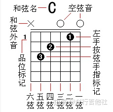

## 基础概念

### 国际标准音
- a1 440Hz la 一弦五品

### 十二平均律
- 吉他的12个品格 相邻一个格子为半音
- 十二平均律（12-tone equal temperament）系统中，将一个八度（音域上的完全重复）分割为 12 个等距的半音。在这个系统中，每个半音的频率比前一个半音的频率要高约 1.059463倍。例如，如果某个音符的频率为 440 Hz（A4音高），那么下一个半音的频率将约为 440 Hz * 1.059463 ≈ 466.1638 Hz。同样地，再下一个半音的频率将约为 440 Hz * 1.059463 * 1.059463 ≈ 493.8833 Hz，依此类推。
- 全半关系不同产生不同调性 
  - C自然大调 全全半全全全半 1 2 3 4 5 6 7 1    (C、D、E、F、G、A、B、C)
  - C自然小调 全半全全半全全 1 2 3b 4 5 6b 7b 1
  - A自然大调 全全半全全全半 6 7 1# 2 3 4# 5# 6 (A、B、C#、D、E、F#、G#、A)
  - A自然小调 全半全全半全全 6 7 1 2 3 4 5 6

### 基本名词
- 根音（Tonic）：它确定了一个音乐调的音高和音阶的起点。在一个调性中，根音是其他音符和和弦相对衡量的基准。C 自然大调的根音是 C，而 A 自然大调的根音是 A。根音是调性的基础音，决定了音阶和和弦的构成。
- 音阶（Scale）是一组按照特定模式排列的音符序列。大调音阶（Major Scale）是一种明亮、欢快的音阶。它由七个音符组成，遵循特定的音程规则，即全全半全全全半（W-W-H-W-W-W-H）的模式。自然小调音阶（Natural Minor Scale）是一种较为哀伤、内敛的音阶。它也由七个音符组成，但其音程模式为全半全全半全全（W-H-W-W-H-W-W）。
- 音名： 音名对应固定的音高，永远不会变。调音器上显示的就是音名。音名是由振动频率决定的。
- 唱名： 
  - C大调中，音名C - 对应唱名Do，唱名是由根音决定的。在 C 大调中，C 被称为 "Do"，D 被称为 "Re"，依此类推。而在 A 大调中，A 被称为 "Do"，B 被称为 "Re"，以此类推。
  - 1 = C 表示Do为C，

- 升调：升半个音 $\#G$
- 降调：降半个音 $B^b$，注意F降调为$E$
- 音程
  - 两个音之间的距离
  - 和谐音程（Consonant Interval）指的是音程听起来悦耳、稳定、和谐的音程。反之不和谐音程。
- 旋律
  - 音符 旋律线
- 节奏
  - 节拍 鼓点
- 和声
  - 抽象，作用是突出旋律，为旋律线服务
  - 除了主旋律之外的所有带有音高的伴奏音乐，都可以归纳到和声
  - 和声线 和弦进行线
- 三度
  - 大三度：主音和三度音之间的关系，如果是两个全音就是大三度
  - 小三度： 一个全音加一个半音
- 小七度
  - 小七度是一个由根音到小七度音所组成的音程。它是由根音向上数七个音符，其中包含十个半音的距离。以 C 为根音的小七度就是从 C 到 $B^b$。这意味着从 C 向上数七个音符，跨越了十个半音的距离，最终到达 B♭。
- 主音：主音（Tonic）是音乐中的基础音，在一个调性系统中，主音是音乐的基准音，其他音符相对于主音来确定它们的音高和音程关系
- 属音：属音（Dominant）是相对于主音的第五个音，位于主音的上方。属音是音乐中具有引导和紧张感的音程，它常常被用于创建和解决音乐的紧张和冲突。

## 和弦级数

### 和弦
- 两个以上的音 具备某种音程关系 同时弹奏的复音效果
- 三和弦
  - 3个音 3度关系
  - 如，选Do为主音，找出三度音和五度音，1 3 5
- 大三和弦：主音和三度音是大三度 三度音和五度音是小三度Major 声音比较欢快
- 小三和弦：主音和三度音是小三度 三度音和五度音是大三度 minor 声音比较悲伤
- 增三和弦：两个都是大三度
- 减三和弦：两个都是小三度
- 一级大三 二级小三 三级小三 四级大三 五级大三 六级小三 七级减三
- 以三和弦为例子，写出七个基础三和弦的列表如下：

    | 主音 | 级数 | 和弦构成 |和弦名称 |
    |----------|------|---------|---------|
    | Do       | I    | Do-Mi-Sol   |主和弦  |
    | Re       | II   | Re-Fa-La    | |
    | Mi       | III  | Mi-Sol-Ti   | |
    | Fa       | IV   | Fa-La-Do    |下属和弦 |
    | Sol      | V    | Sol-Ti-Re   |属和弦  |
    | La       | VI   | La-Do-Mi    | |
    | Ti       | VII  | Ti-Re-Fa    | |
### 和弦特性和功能
- 主和弦：以主音为跟音的三和弦 一级和弦 例如C大调中C和弦为主和弦
  - 主和弦非常稳定 歌曲的开始和结尾，例如 C - G - C
- 属和弦：以属音为根音的三和弦 五级和弦，例如C大调中G和弦为属和弦
  - 略微不稳定，具有导向主和弦的功能，例如Am - G - C
- 属七和弦：属和弦 + 小七度
  - 以C 大调为例子
  - 属和弦是G和弦： G B D
  - G7： G B D F， F是G的小七度
  - 小七度使得属七和弦更不稳定，强烈导向主和弦，例如Am-G7-C
- 属七和弦的应用
  - 让和弦更加顺畅，常用作两段之间过渡，导出下一段的主和弦

### 和弦指法图
- 吉他琴弦，最细的吉他弦称为一弦，最粗的是六弦，从最细到最粗依次是一二三四五六弦。
  
- 和弦图是表示左手所按和弦的指法及位置的图示。由六条纵向的平行线和若干条横向的平行线组成。六条纵向平行线从左全右分别代表吉他的⑥、⑤、④、③、②、①弦，横向平行线代表吉他的品拄。
- 数字1，2，3，4代表的是左手的手指，1代表的是食指，2代表的是中指，3代表的是无名指，4是小尾指。数字放在哪条线（弦）上表示要当相应的手指按在相应的琴弦以及品格上面。
- 横按： 和弦图上一条黑色横线表示食指横按这条线所覆盖的所有琴弦

### 和弦级数
- 和弦级数表，行为调性，列为级数

### 换调
- 原调 1=E 选调1=C，可以把变调夹夹在4品 C到E是4个半音，就把E大调的和弦级数转换成了C大调

### 七和弦
- 一级 1 3 5 7
  - CMaj7
  - C大大七
- 二级 2 4 6 1
  - Dmin7
  - D小小7
- 五级 5 7 2 4
  - G7
  - G大小7
  - G属7
- 七和弦和三和弦的区别
  - 七和弦是暧昧的和弦，明亮和忧伤的色彩都有，三和弦是比较明确的色彩

## 音阶
