### FP原因

- 熄火前静止时间过少可能导致油量没来得及更新而发生误报警
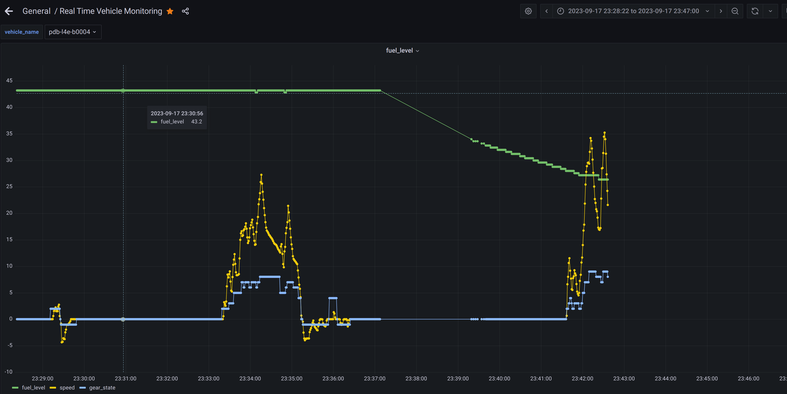

- 启动时发动机泵油导致油量数据不稳定
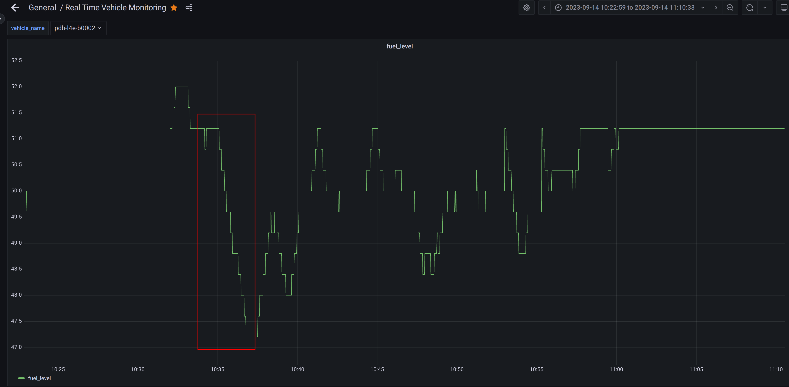

- 临时停车时油箱晃动导致油量数据不稳定

### 重启后多久传感器会稳定？
- 无法确定，最长可能十几分钟都不稳定，极差能达到5%
  - 这张图是报的重启报警，熄火时之前存在3分钟速度为0的曲线，那时油量数据没动，熄火三分钟后重启时油量突然下降很多，要么就是停稳后很长时间油箱数据都不稳定，要么就是启动时油量数据可能异常（个人认为后面一种可能性大）
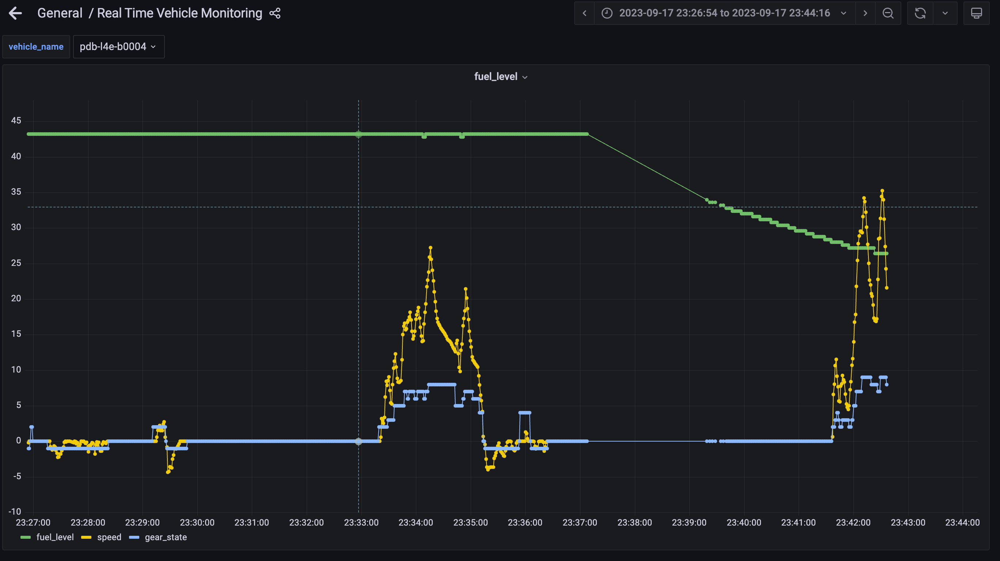
  - 这张图是重启很长时间不稳定
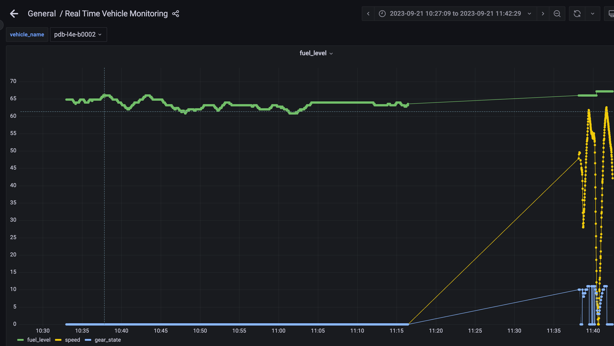

### 停稳后多久传感器会稳定?
- 有时是停了就更新变稳定
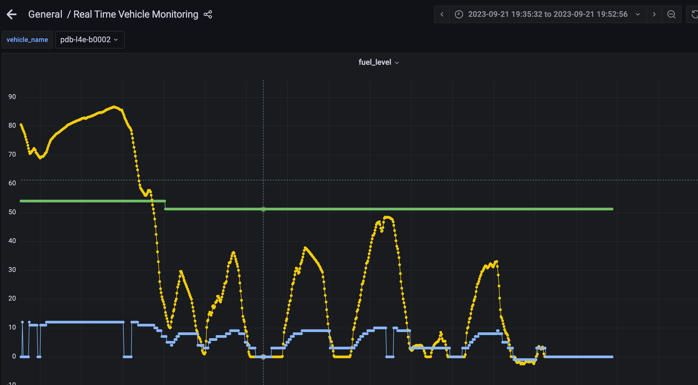
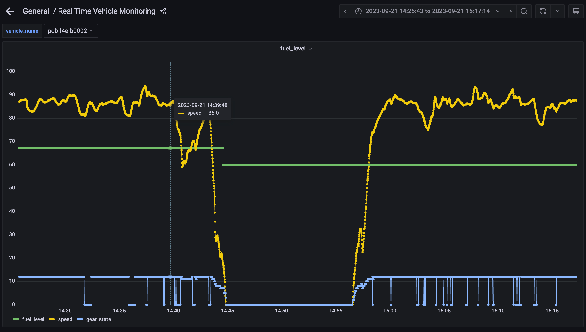

- 有时半分钟到一分多钟都不稳定
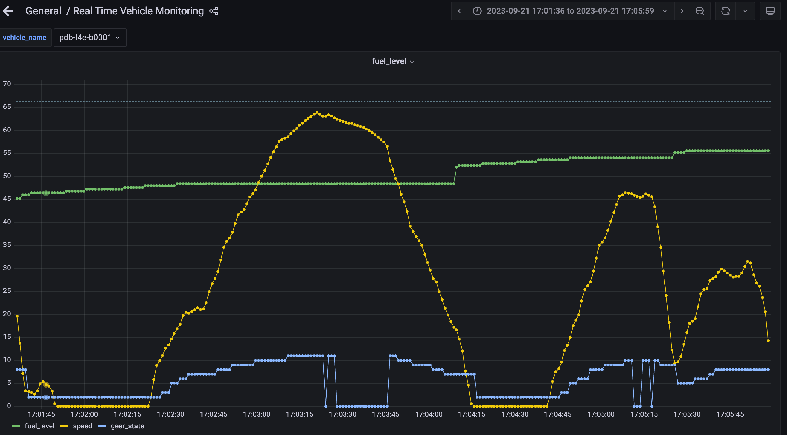
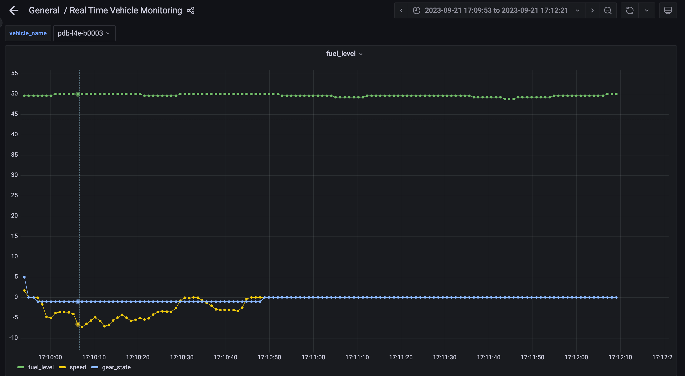
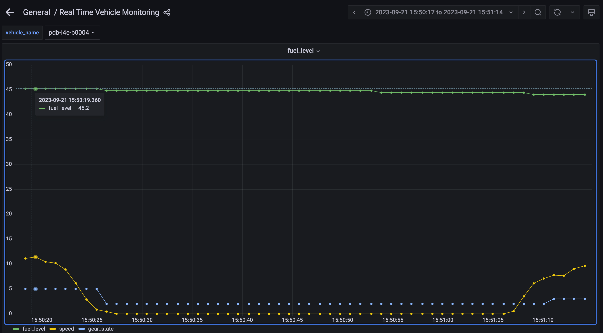

- 大多数停稳后的油量波动幅度不大，一般在两个下降沿左右，或者是存在异常上升

### 一些其他的corner case
- dbw数据丢失，可能是因为vehicle_node挂掉，vehicle_node重启后误认为是车辆重启对比油量有减少，restart误报警
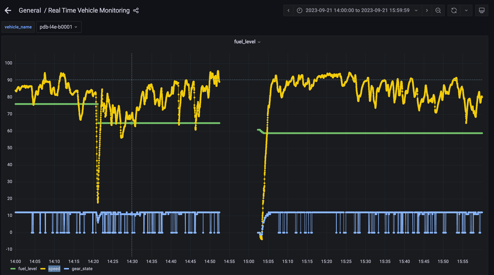

- 油量数据没有,speed有
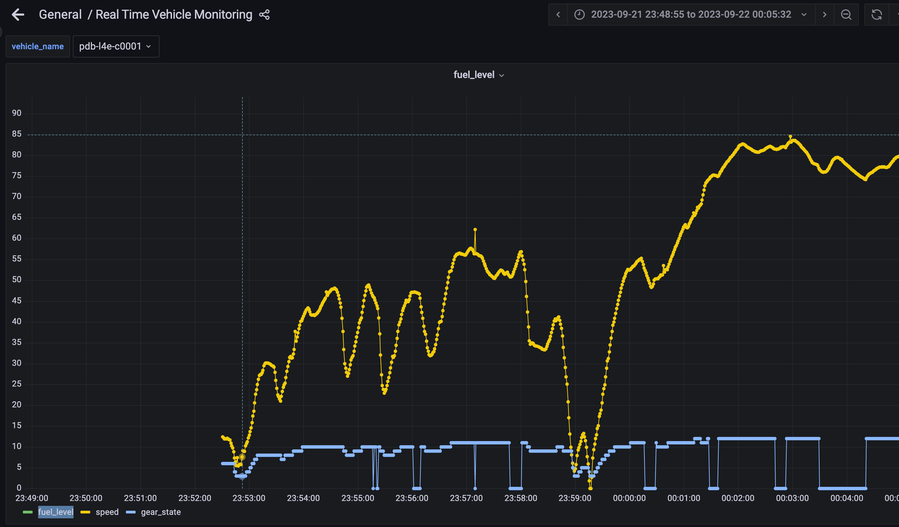